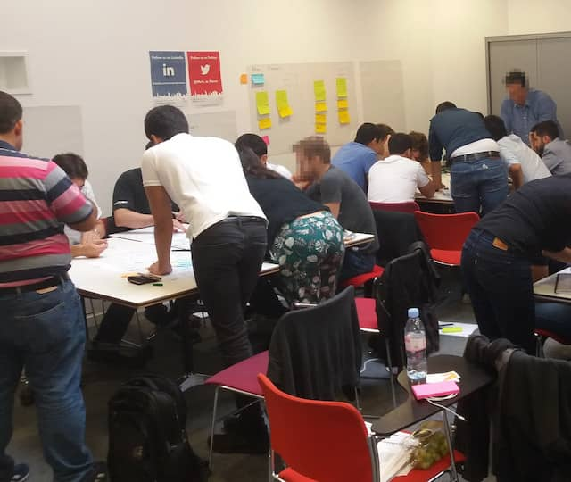

# Guide d'animation pour le Built-in Quality game

Ce guide s'adresse à l'animateur du Built-in Quality game. Il contient des conseils et des astuces pour réussir votre première session.

## Avant le jeu

Juste après avoir présenté les [règles](Rules_FR.md) du jeu, laissez quelques minutes aux participants pour lire leur rôle et comprendre les [règles](Rules_FR.md). C'est un bon moment pour circuler et demander aux participants s'ils ont des questions.

## Exécution à blanc

L'exécution à blanc permet à tout le monde de se familiariser avec les [règles](Rules_FR.md) du jeu. Encore une fois, circulez et vérifiez que le jeu est joué correctement.

## Pendant le jeu

L'expérience montre que les équipes ont souvent du mal à être suffisamment disciplinées pour se limiter à une amélioration toutes les 5 minutes. Pour les aider, distribuez uniquement les tickets d'amélioration (les rouges) toutes les 5 minutes.

## Après le jeu

### Comment mener la rétrospective

Il existe de nombreuses façons de mener la rétrospective. Les [règles](Rules_FR.md) suggèrent la méthode classique Do/Learn/Puzzle/Decision. Si vous ne vous sentez pas à l'aise avec cette méthode, essayez-en une autre que vous préférez. Par exemple, l'activité "1-2-4-tous" des structures libératrices (http://www.liberatingstructures.com/1-1-2-4-all/) devrait également bien fonctionner. Quelle que soit la méthode choisie, veillez à respecter strictement les délais ou cela risque de déborder sur votre temps de session.

### Autres points clés

Après leur rétrospective, les participants partageront leurs propres apprentissages. Ils pourraient passer à côté de quelque chose d'important. Voici une liste des points principaux. Si les participants en ont manqué certains, vous pouvez les mentionner *gentiment*.

* *« La qualité est gratuite... mais seulement pour ceux qui sont prêts à la payer ! »* Tom de Marco​
* Être occupé n'est pas une mesure très fiable de la productivité​
* Nous pouvons compenser les besoins de ré-usinage (rework) en prévoyant du temps libre !​
* Rationaliser le prévisible (TDD, BDD, CI, DevOps)​
* Expérimenter tôt face à l'imprévisible (Lean Startup, Walking Skeleton)​

Ne faites pas tout un plat à leur sujet non plus... Le véritable apprentissage vient de l'expérience, pas de principes préétablis.

### Réponses aux principales objections

Les participants pourraient se plaindre que l'exercice n'est pas valide. Voici les réponses les plus fréquentes.

> Le TDD est survendu ici !

* L'équipe de Van Schooenderwoert a en moyenne un bug et demi par mois dans un domaine très difficile. Voir [Embedded Agile Project by the Numbers With Newbies](http://leanagilepartners.com/library/Vanschooenderwoert-EmbeddedNumbers.pdf)
* "Au cours des 12 mois suivants, le nouveau système n'a eu que six bugs. Cela a prouvé à la direction que le développement agile, en particulier l'écriture des tests en premier, était une bonne idée et qu'il améliorait considérablement la qualité" (extrait de [Specification by Examples](https://www.amazon.com/Specification-Example-Successful-Deliver-Software/dp/1617290084))

> Le BDD est survendu ici !

* Voici des exemples de taux de défauts atteignables avec le BDD (extraits de [Specification by Examples](https://www.amazon.com/Specification-Example-Successful-Deliver-Software/dp/1617290084)).
   * "Ils n'ont signalé que 5 bugs au cours des deux années depuis la mise en service du système"
   * "... a réussi les tests d'acceptation métier en une journée et n'a signalé aucun bug pendant les six mois qui ont suivi"

> Ce jeu est plus agréable que la réalité !

En effet, la dette technique rend la réalité encore plus difficile.

> Ce n'est pas pertinent pour nous car nous n'utilisons pas Kanban !

[Les limites de travail en cours](https://searchsoftwarequality.techtarget.com/definition/WIP-limit) sont utilisées comme moyen de simuler le débit.

> Les choses du [Lean Startup](http://theleanstartup.com/) ne concernent pas les développeurs !

En effet, selon le stade de l'entreprise, le Lean Startup est plus ou moins important (essentiel pour les start-ups, peut être négligé pendant longtemps par les entreprises établies).

## Aller plus loin

Comme je l'ai dit au début, ce jeu vise à simplifier l'apprentissage de la théorie des files d'attente. Si vous souhaitez en savoir plus sur le sujet, et en particulier sur la manière dont il peut être appliqué à l'ingénierie logicielle, le livre [Flow](https://www.amazon.com/Principles-Product-Development-Flow-Generation/dp/1935401009/ref=sr_1_1?ie=UTF8&qid=1548951433&sr=8-1&keywords=reinertsen+flow) est l'endroit où aller.

---

Built-in Quality game par <a xmlns:cc="http://creativecommons.org/ns#" href="http://philou.github.io/built-in-quality-game/" property="cc:attributionName" rel="cc:attributionURL">Philippe Bourgau</a> est sous licence [Creative Commons Attribution-ShareAlike 4.0 International](http://creativecommons.org/licenses/by-sa/4.0/).
