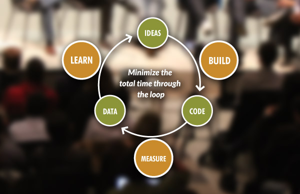
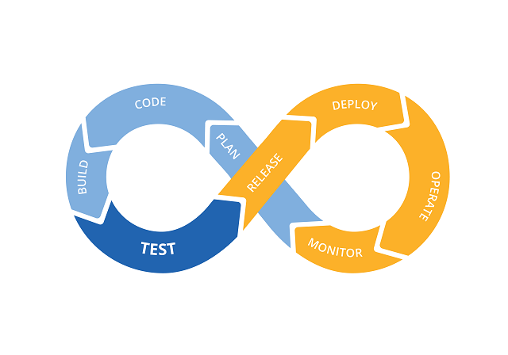

# Pratiques de qualité intégrée

## Lean Startup
Lean startup est une méthodologie de développement d'entreprises et de produits qui vise à raccourcir les cycles de développement de produits et à découvrir rapidement si un modèle commercial proposé est viable. Cela est réalisé en adoptant une combinaison d'expérimentation axée sur les hypothèses commerciales, de versions itératives du produit et d'apprentissage validé.

Au cœur de la méthodologie Lean Startup se trouve l'hypothèse selon laquelle, lorsque les startups investissent leur temps dans la construction itérative de produits ou de services pour répondre aux besoins des premiers clients, l'entreprise peut réduire les risques du marché et éviter le besoin de financement initial important et de lancements de produits coûteux et infructueux.

(source: http://theleanstartup.com/principles)

### Principes
* Produit Minimum Viable (MVP)
* Déploiement continu (CD)
* Tests fractionnés
* Métriques exploitables
* Pivot
* Comptabilité de l'innovation
* Construire-Mesurer-Apprendre

### Avantages
Les principaux avantages de Lean Startup sont :
* Plus proche des clients
* Plus facile de pivoter et de réagir aux opportunités du marché
* Permet de s'attaquer à des marchés et opportunités plus petits
* Encourage l'innovation rapide et efficace
* Coûts de vente et de marketing très faibles

### Ressources
1. [Lean Startup - Wikipedia](https://en.wikipedia.org/wiki/Lean_startup)
2. [David vs. Goliath: Your Startup’s Guide to Giant-Killing](https://openviewpartners.com/blog/lean-startup-advantages-david-vs-goliath)

## Walking Skeleton
Alistair Cockburn définit le 'Walking Skeleton' comme une petite implémentation du système qui effectue une petite fonction de bout en bout. Il n'est pas nécessaire d'utiliser l'architecture finale, mais il doit relier les principaux composants architecturaux. L'architecture et la fonctionnalité peuvent ensuite évoluer en parallèle.

Cette approche aide les développeurs à identifier toutes les grandes inconnues d'un logiciel et à réduire ainsi les risques sur les grands projets de développement de logiciels !

### Pratiques

#### Les plus risquées d'abord
Il est préférable de travailler d'abord sur les parties les plus risquées du projet, car on ne sait pas combien de temps cela prendra et quels problèmes peuvent survenir. Cela permet de raccourcir la boucle de feedback.

#### Pas de raccourcis
Le premier test d'acceptation ne doit être écrit que lorsque le walking skeleton est déployé en production. Idéalement, vous voulez détecter les problèmes potentiels avec votre déploiement et vos scripts de construction le plus tôt possible. Cela vous permet de valider l'architecture et d'obtenir des feedbacks le plus tôt possible.

En prenant des raccourcis, il y a un risque que de tels feedbacks soient perdus !

### Avantages
Certains avantages du 'Walking Skeleton' sont :
* Valider les hypothèses
* Vérification de la réalité
* Réduction des risques
* Feedbacks plus rapide

### Ressources
1. [BUILDING A WALKING SKELETON](https://www.capriconsulting.co.uk/2018/03/28/building-a-walking-skeleton/)
2. [Start Your Project with a Walking Skeleton](https://www.henricodolfing.com/2018/04/start-your-project-with-walking-skeleton.html)

## Test-Driven Development (TDD)

Le TDD est basé sur trois règles, connues sous le nom de 'Les trois lois du TDD' :

* Vous devez écrire un test qui échoue avant d'écrire du code de production.
* Vous ne devez pas écrire plus de test que nécessaire pour échouer, ou échouer à la compilation.
* Vous ne devez pas écrire plus de code de production que nécessaire pour faire passer le test actuellement en échec.

En code, le TDD se traduit par le cycle Rouge/Vert/Refactoriser !

(source: https://blog.cleancoder.com/uncle-bob/2014/12/17/TheCyclesOfTDD.html)

Les règles de ce cycle sont les suivantes :
* Créer un test unitaire qui échoue
* Écrire du code de production qui fait passer ce test.
* Nettoyer le désordre que vous venez de créer.

### Avantages
Les 3 avantages du TDD sont :
* Nécessite une compréhension approfondie de ce que le code devrait faire
* Augmente la confiance dans la modification des parties du code
* Réduit le temps de débogage

### Ressources
1. [The Cycles of TDD - CleanCoder](https://blog.cleancoder.com/uncle-bob/2014/12/17/TheCyclesOfTDD.html)
2. [Test-driven development - Wikipedia](https://en.wikipedia.org/wiki/Test-driven_development)

## Développement axé sur le comportement (BDD)

Le BDD est la combinaison de pratiques du TDD, de la conception pilotée par le domaine (DDD) et de la conception orientée objet pour produire des outils et des processus de collaboration en développement logiciel. Ces outils et pratiques mettent l'accent sur le fait que le développement logiciel devrait être géré par les intérêts commerciaux et les connaissances techniques.

### Principes

#### Test
En termes de test, le BDD est considéré comme une continuation du TDD car il met davantage l'accent sur le comportement souhaité de l'unité. Le 'comportement souhaité' comprend les exigences définies par l'entreprise.

#### Spécifications comportementales
Le deuxième principe définit comment le 'comportement souhaité' doit être écrit. Ici, le BDD utilise les termes 'Scénario' et 'Spécification' pour rassembler toutes les exigences et les résultats attendus en un seul endroit, qui est une User Story.

Bien qu'il n'y ait pas de format officiel défini dans le BDD, il est préférable de suivre la forme 'Given-When-Then'.

#### Spécification en tant que langage omniprésent
Le langage omniprésent est défini dans le DDD. Il s'agit d'un langage 'semi-formel' développé et utilisé par les membres de l'équipe pour avoir une compréhension commune de la discussion entre eux. Cela réduit les risques de rupture de communication entre les développeurs et les parties prenantes.

### Avantages
Les 3 avantages du BDD sont :
* Guide et organise la conversation entre les différentes parties de l'équipe de développement logiciel (développeurs, testeurs et experts métier)
* Le canevas given-when-then est plus proche du langage courant
* Les outils ciblant une approche BDD permettent généralement la génération automatique de documentation technique et utilisateur à partir des "spécifications" BDD

### Ressources
1. [Behavior Driven Development (BDD) - Agile Alliances](https://www.agilealliance.org/glossary/bdd/)
2. [Behavior-driven development - Wikipedia](https://en.wikipedia.org/wiki/Behavior-driven_development)

## Intégration continue (CI)
L'intégration continue est un processus qui aide les développeurs à détecter les problèmes plus rapidement grâce à une intégration fréquente du code dans un référentiel partagé. Les tests de construction, de régression et d'acceptation sont automatisés et exécutés à chaque validation.

(source: http://www.pepgotesting.com/continuous-integration/)

### Pratiques
* Maintenir un seul référentiel source
* Automatiser le build
* Rendre votre build autotestable
* Chaque commit doit déclencher un build sur une machine d'intégration
* Maintenir un build rapide
* Tester dans un clone de l'environnement de production
* Faciliter l'obtention de la dernière version exécutable par n'importe qui
* Tout le monde peut voir ce qui se passe
* Automatiser le déploiement

### Avantages
Les 3 avantages de l'intégration continue sont :
* Générer un logiciel déployable à tout moment et en tout lieu
* Raccourcit la boucle de feedback et réduit les risques opérationnels, techniques et humains
* Réduit le temps de débogage

### Ressources
[CONTINUOUS INTEGRATION - ThoughtWorks](https://www.thoughtworks.com/continuous-integration)

## DevOps
DevOps est un ensemble de pratiques qui combine le développement logiciel (Dev) et les opérations informatiques (Ops) dans le but de raccourcir le cycle de vie du développement des systèmes et de fournir une livraison continue avec une haute qualité logicielle.

(source: https://guide.freecodecamp.org/devops/)

### Pratiques
* Coding : développement et révision du code, outils de gestion du code source, fusion du code
* Building : outils d'intégration continue, état de la construction
* Testing : outils de test continu
* Packaging : référentiel d'artefacts, pré-déploiement de l'application
* Releasing : gestion des changements, approbations de publication, automatisation de la publication
* Configuring : configuration et gestion de l'infrastructure, outils d'infrastructure en tant que code
* Monitoring : surveillance des performances des applications, expérience utilisateur finale

### Avantages
Les 3 avantages de DevOps sont :
* Des versions plus rapides et un temps de mise sur le marché réduit
* Un taux d'échec et une durée d'arrêt réduits
* Un délai de correction raccourci

### Ressources
[DevOps - Wiki](https://en.wikipedia.org/wiki/DevOps)

## Craftsmanship
Le Software craftsmanship est une approche du développement logiciel qui met l'accent sur les compétences de codage des développeurs de logiciels. C'est une réponse des développeurs de logiciels aux maux perçus de l'industrie logicielle traditionnelle, y compris la priorisation des préoccupations financières par rapport à la responsabilité des développeurs.

Le Software craftsmanship est venu en continuité du cadre Agile. Agile met l'accent sur les individus, la collaboration en équipe et le rythme de travail. Mais il ne couvre pas la qualité du code ou la conception. L'artisanat logiciel a été défini pour couvrir ces principes manquants, car il garantit qu'un logiciel doit être à la fois fonctionnel et bien conçu.

### Manifeste
En tant qu'artisans logiciels aspirants, nous élevons le niveau du développement logiciel professionnel en le pratiquant et en aidant les autres à apprendre le métier. À travers ce travail, nous avons appris à valoriser :
* Non seulement un logiciel fonctionnel, mais aussi un logiciel bien conçu
* Non seulement répondre au changement, mais aussi ajouter de la valeur de manière constante
* Non seulement les individus et les interactions, mais aussi une communauté de professionnels
* Non seulement la collaboration avec les clients, mais aussi des partenariats productifs

### Servir l'agilité
Le Software craftsmanship emprunte des pratiques à d'autres méthodes agiles :
• Qualité : conception simple, DDD, OO, refactoring, TDD (XP)
• Humilité : remise en question et amélioration continue (rétrospectives)
• Partage : programmation en binôme et propriété collective (XP)
• Pragmatisme : je comprends les contraintes et je m'adapte (Scrum)
• Professionnalisme : je traite mon client comme un partenaire (XP)

### Ressources
[Software craftsmanship - Wikipedia](https://en.wikipedia.org/wiki/Software_craftsmanship)
[Manifesto for Software Craftsmanship](http://manifesto.softwarecraftsmanship.org/)
[How Software Craftsmanship Completes Agile Methods](https://blog.comet.co/engineering/how-software-craftsmanship-completes-agile-methods/)

