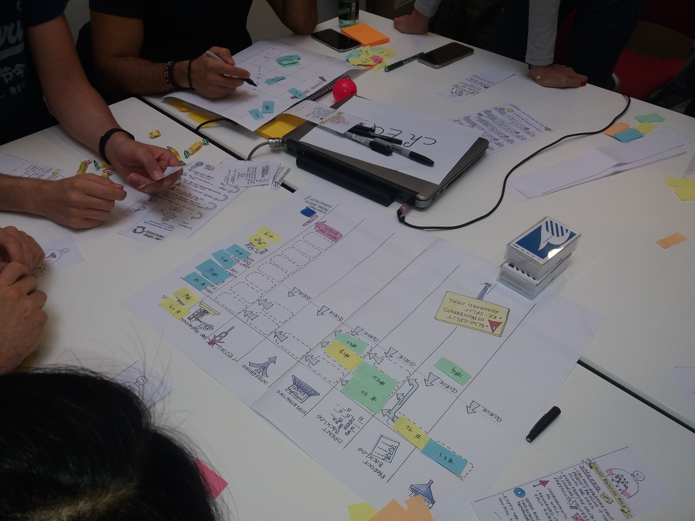

# Built-in Quality Game

> Learn how investing in software development best practices will make you more productive by playing rather than learning queuing theory!

[Queuing theory](https://en.wikipedia.org/wiki/Queueing_theory) is the real explanation of why investing in quality up-front will make your team faster. The problem is that it is not the funniest topic to study. After trying the standard training approach at [Murex](www.murex.com), we decided to go for something else, and created this table-top (serious) game.

## How does it go?

The game is a collaborative game that lasts for about 1h15. The whole team can play. While the game's goal is to maximize output, the training goal is to let people experience the change in flow as they invest in new skills.

## How to use this game?

Playing the game is a 4 steps process:

1. Read the [rules](Rules.md)
2. Read the [animator's guide](AnimationGuide.md)
3. Print and cut-out the [material](https://github.com/philou/built-in-quality-game/tree/master/material)
4. Play the game

## Contributing

PRs accepted.

Commit messages should follow [semantic commit messages](https://seesparkbox.com/foundry/semantic_commit_messages) and these [commit message best practices](https://chris.beams.io/posts/git-commit/)

Material is licensed under [Creative Commons Attribution-ShareAlike 4.0 International License](http://creativecommons.org/licenses/by-sa/4.0/). Add this to the metadata of the pictures before committing. It's easy to do using `exiftool -tagsFromFile CC_Attribution-ShareAlike_4.0_International.xmp best-practices.jpg`. Build your own xmp file with [Creative Commons License Picker](https://creativecommons.org/choose).

## Credits and contributors

Coaches at [Murex](https://github.com/murex), mostly:
* [Damien Menanteau](https://about.me/damienmenanteau)
* [Hicham Ghorayeb](https://twitter.com/hghorayeb)
* [Joseph Soares](https://www.linkedin.com/in/joseph-soares-19812b13/?originalSubdomain=fr)
* [Julie Jeru](https://fr.linkedin.com/in/juliejeru)
* [Matthieu Tournemire](https://twitter.com/mattrussa)
* [Philippe Bourgau](http://philippe.bourgau.net)

## License

Built-in Quality Game by <a xmlns:cc="http://creativecommons.org/ns#" href="http://philou.github.io/built-in-quality-game/" property="cc:attributionName" rel="cc:attributionURL">Philippe Bourgau</a> is licensed under a [Creative Commons Attribution-ShareAlike 4.0 International License](http://creativecommons.org/licenses/by-sa/4.0/).