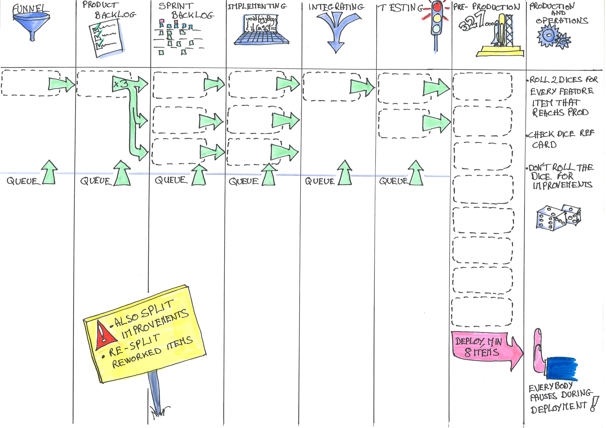
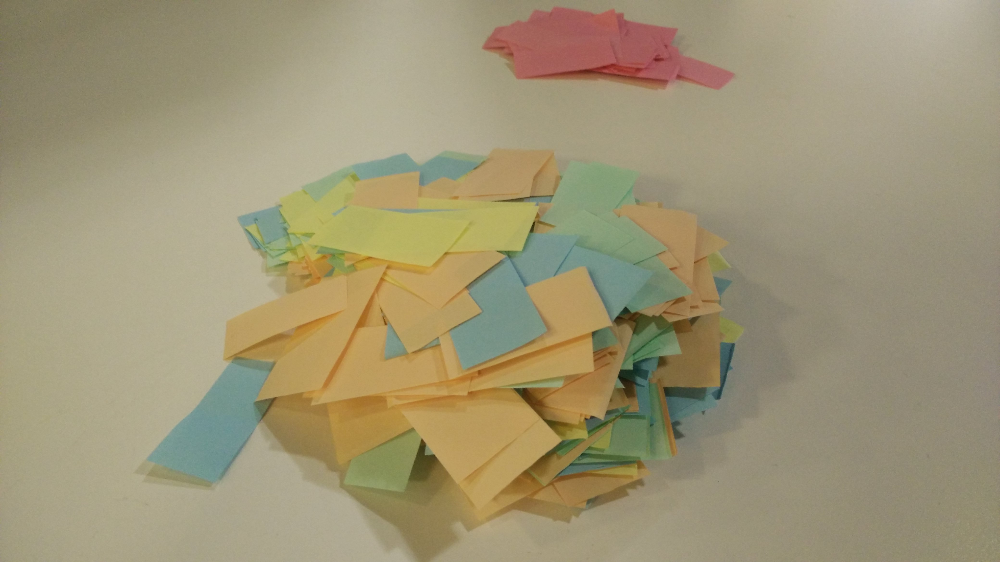
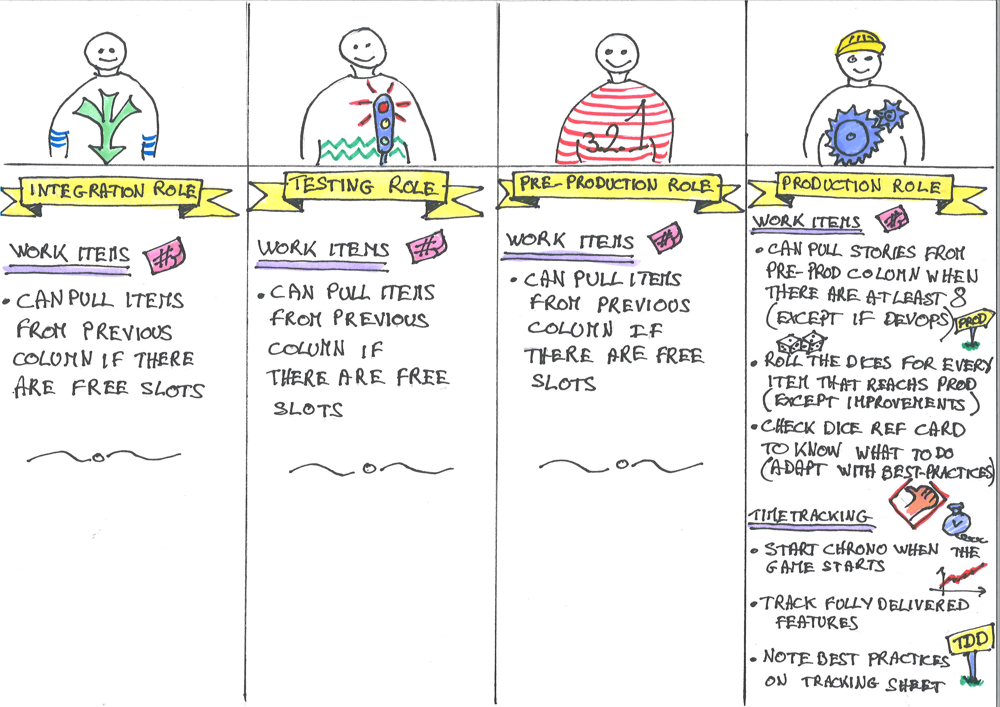

# Rules of the Built-in Quality Game

## Goal of the game

To pull as many features from Funnel to Production as possible.

Experience the increase in value delivery as we add more built-in quality to our software development process.

## Typical Game Workflow

You are a team of fresh grad starting a new project. You have a lot of ideas, but everything is still to do. During the game, we'll represent building the product as a [Kanban board](https://en.wikipedia.org/wiki/Kanban_board), and work items as small colored pieces of paper.

At first, as a fresh grads, you'll suffer from your lack of build-in quality practice. As time goes, and as you master industry best practices, you'll see your flow of value improve.

Every team member will take one 1 or more roles and will be responsible to pull work items in his column. If something goes bad when an item reaches production, it will have to be reworked. The more best practices in place, and the smoother the release will become.

The game is played in rounds (representing days). During a round, each team member can pull items from the previous column *once*. It's only when all the players have pulled their work items, that we can move to the next round.

### Game Setup (10m)

1. Create a team of up to 8.
2. Teams discover the material  
3. Team members pick one or more roles (preferably in adjacent columns), and read their role(s) reference card
4. Team members can have a look at the best practices and their effects on the flow.
5. If there are aspects of the rules that you did not understand, it's a good time to ask the animator

### Blank run (10m)

Before jumping in the game at full speed, it's a good time to have 15 rounds of play to get the grasp of it.

1. The production player (the time tracker) gives the go.
2. At first, all the columns are empty, so the only player who can pull some work in is the 'Funnel' player.
3. Every round, a new player can start to pull work in a new column
4. By the 15th round, work can be pushed to production. It's time to practice a blank release
5. Once all effects of the release have been done. Stop the blank run

### Real game (45m)

Now that everyone understood the game, let's play for real

1. Remove all the work items from the board
2. Start with a blank tracking sheet
3. Let the team randomly pick a 'free' unfair advantage best practice to start with. If they get 'Craftsmanship', no luck, they start with nothing.
4. As with the blank run, the production player gives the go.
5. The game goes on as before. The production player should keep track of the delivered features per round (day)
6. As the team invests in engineering practices, they should see the flow improve

### Retrospective and Learning (10m)

Stop the game 10 minutes before the end of your time slot. Answer the following questions.

1. What did we do?
2. What did we learn?
3. What still puzzles us?
4. What can we decide for 

If many teams played alongside each other, everyone could share the main takaway they had from the game. 

### Real-Time Variant

We tried a real-time variant of the game. On the plus side, its faster and more engaging. On the flip side, there won't be the same kind or amount of learning.

You can squash this session in 45 minutes instead of 75. In this variant, there are no rounds. All the players play simultaneously, and are continuously pulling items to their columns. The time is tracked in real-time minutes instead of rounds.

Be warned though, that people will learn more about lean flow here than from built-in quality.

## Characteristics of the game

### Number of players

The game is played in teams of up to 8. Many teams can play alongside each other during the same session. The more teams the better to discuss learning at the end.

### Duration

1h to 1h15 including preparation and end of session learning.

## Material

Every team needs the following:

### An 8-columns board

To print on A3

### A heap of colored work item cards

Work is represented by small colored tickets. You need to cut out a bunch of these before the game. Cut these to fit in the width of the Kanban columns.

Use separate red tickets for best practice improvements 

### 7 Best practice cards

To print on A4

### Dice and best practices reference cards

To print on A4

### 2 6-faced dices

_Gaz at English Wikipedia [CC BY-SA 3.0](http://creativecommons.org/licenses/by-sa/3.0/), via Wikimedia Commons_

### 8 roles cards

To print on A4

### A tracking sheet

To print on A3

### Column hiders

To print on A4

### Larger printing

If you want, it might be convenient to print everything at twice the size.