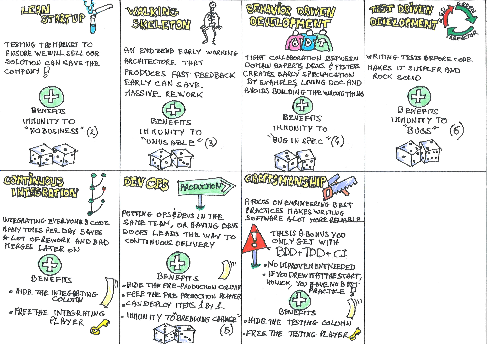
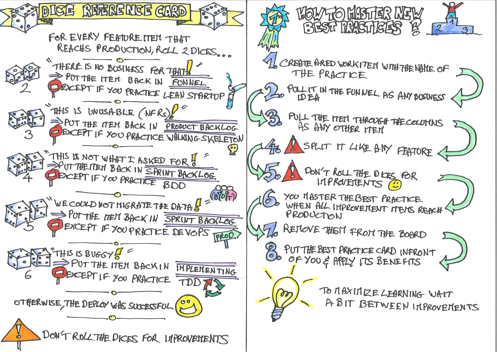
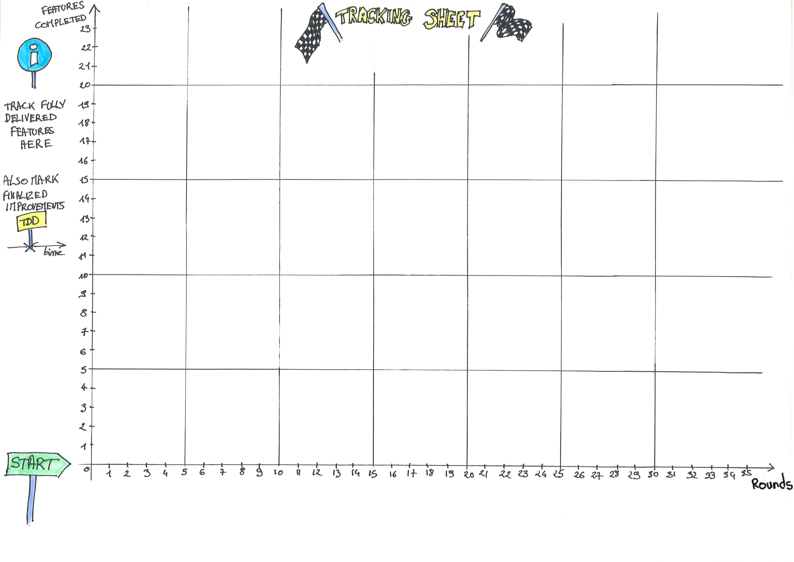

# Rules of the Built-in Quality Game

[](photos/1-team.jpeg)

## Goal of the game

To pull as many features from Funnel to Production as possible.

Experience the increase in value delivery as we add more built-in quality to our software development process.

## What it looks like

You are a team of fresh grad starting a new project. You have a lot of ideas, but everything is still to do. During the game, we'll represent building the product as a [Kanban board](https://en.wikipedia.org/wiki/Kanban_board), and work items as small colored pieces of paper.

At first, as a fresh grads, you'll suffer from your lack of build-in quality practice. As time goes, and as you master industry best practices, you'll see your flow of value improve.

Every team member will take one 1 or more roles and will be responsible to pull work items in his column. If something goes bad when an item reaches production, it will have to be reworked. Regularly, you can chose to work on mastering new practices instead of features. The more best practices in place, and the smoother the release will become.

The game is played in rounds (representing days). During a round, each team member can pull items from the previous column *once*. It's only when all the players have pulled their work items, that we can move to the next round.

The game ends when you feel you have learned enough. Take the opportunity to discuss your insights with other participants.

The material is built to be as self-explanatory as possible. So it should be possible to have people play without reading the full instructions up-front.

## Suggested session agenda

This is an agenda we prepared for a 1h30 conference workshop.

|Phase | Details | Duration | Elapsed Time |
|------|---------|----------|--------------|
| General presentation | Present the game and its goal | 5m | 5m|
| Think it then ink it | Let participants recall what they already know about built-in quality | 5m | 10m |
| One person expert jigsaw | Hand pieces of information about built-in quality to different people, let them reconstruct an image | 10m | 20m|
| Built-in quality presentation| Quick summary of what built-in quality is | 5m | 25m |
| Game setup | Show the instructions and let the teams setup their game | 510m | 35m |
| Play level 1 | The game starts, participants get use to it | 10m | 45m |
| Play level 2 | Give red (improvement) tickets to participants | 10m | 55m |
| Play level 3 | Give another red (improvement) tickets to participants | 10m | 1h05 |
| Play level 4 | Give yet another red (improvement) tickets to participants | 10m | 1h15 |
| Learning log | Ask participants to write down what they learned during the session, and discuss about it together | 10m | 1h25 |

It relies on the C4 workshop model presented in the book [Training from the back of the room](https://www.goodreads.com/book/show/8141935-training-from-the-back-of-the-room).

Here are [corresponding slides](material/Built-In%20Quality%20Game.pdf).

### General presentation

Check [Goal of the Game](#) section.

### Think it then ink it

This is an activity from the book [Training from the back of the room](https://www.goodreads.com/book/show/8141935-training-from-the-back-of-the-room). Here are the instructions:

`Think about what you already know about built-in quality. Write three of these facts on an index card. Be ready to state them when asked.`

### One person expert jigsaw

Again, this is an activity from the book [Training from the back of the room](https://www.goodreads.com/book/show/8141935-training-from-the-back-of-the-room). The goal is to provide different parts of the information to different people at the table. It's then up to them to summarize what they have understood and make all the parts fit together.

`You each received a different information about built-in quality.`

`Exchange with your colleagues until one of you can summarize the full content to all the table​.`

### Built-in quality Presentation

> Inspection does not improve the quality, nor guarantee quality. Inspection is too late. The quality, good or bad, is already in the product. Quality cannot be inspected into a product or service; it must be built into it.
>
> —W. Edwards Deming

Here is the key idea behind built-in quality: the earlier in the delivery process an error is made, the more waste it will generate until the feature satisfies the customer.

For example:

* If you build the wrong product, the design, coding, testing... in fact *all* the work on this product will be wasted
* If a developer leaves a bug in his implementation of a feature, this will limit waste to testing, support and rework
* At the other side, if an error is left in delivery configuration, then it should be fixed very cheaply 

Built-in quality is a set of practices and principles that enable to avoid errors in the first place, instead of trying to fix them later. Typical built-in quality practices include:

* Test Driven Development
* Behaviour Driven Development 
* Continuous Integration
* Dev-Ops
* Walking Skeleton
* Lean Startup

### Game Setup

Check the [What it looks like](#) section.

```
Let's start to play! 

1. Create a team of up to 8. Try to mix profiles (technical, business, test...)
   to maximize learning
2. Take 1 minute to discover the material
3. You'll each be responsible for one or more columns on the kanban board. Each
   team member should pick one or more roles (preferably in adjacent columns),
   and read their role(s) reference card. Optionally, the production-role 
   person can use a laptop and a shared spreadsheet (instead of a sheet of
   paper) to track the progress throughout the game.
4. Have a look at the best practices and their effects on the flow.
5. Have a look at reference cards to get a final grasp of the game.
6. If there are aspects of the rules that you did not understand, it's a good 
   time to ask the animator
```

Here is [a google sheet scoreboard](https://docs.google.com/spreadsheets/d/15K90zPhD02unMYQVIwJEs9rjMmrr_ksaoTUjFuXrz4g/edit?usp=sharing)
 you can copy to track your progress.

### Play level 1

```
Before jumping in the game at full speed, it's a good time to have a few rounds
of play to get the grasp of it.

1. The production player (the time tracker) gives the go.
2. At first, all the columns are empty, so the only player who can pull some
   work in is the 'Funnel' player.
3. Every round, from right to left, players can pull work in their column if
   there are tickets in the previous one
4. By the 15th round, work can be pushed to production. It's time to practice a
   blank release
```

### Play level 2

```
Now that everyone masters the game, let's play for real!

1. Let the team randomly pick a 'free' unfair advantage best practice to start
   with. If they get 'Craftsmanship', no luck, they start with nothing :-(
2. Pause for a while and read out loud the reference documentation about this
   new practice.
3. Apply the actions of this best practices, and resume the game.
4. As before, the production player should keep track of the delivered features
   per round
```

### Play level 3 and 4

```
Every 10 minutes, the organizers will provide you red (improvement) tickets
that you can use to master a new skill.

1. Discuss until you come to an agreement about what skill you want to invest
   in.
2. When the improvement ticket reaches production, pause and read the best
   practice reference documentation aloud.

/!\ Red (improvemnt) tickets:
* get split as any feature
* get through production without rolling the dice
```

### Learning log

This is an activity from the book [Training from the back of the room](https://www.goodreads.com/book/show/8141935-training-from-the-back-of-the-room). Here are the instructions:

`In what ways does this information change previous perceptions you’ve held about built-in quality? How do you think you might use this information? Be ready to share with your table.`


## Real-Time Variant

We tried a real-time variant of the game. On the plus side, it's faster and more engaging. On the flip side, there won't be the same kind or amount of learning.

You can squash this session in 45 minutes instead of 75. In this variant, there are no rounds. All the players play simultaneously, and are continuously pulling items to their columns. The time is tracked in real-time minutes instead of rounds.

Be warned though, that people will learn more about lean flow here than from built-in quality.

## Characteristics of the game

### Number of players

The game is played in teams of up to 8. Many teams can play alongside each other during the same session. The more teams the better to discuss learning at the end.

### Duration

1h to 1h15 including preparation and end of session learning.

## Material

Every team needs the following:

### An 8-columns board


To print on A3

### A heap of colored work item cards

[](photos/tickets.jpg)

Work is represented by small colored tickets. You'll need to cut out a bunch of these before the game. Cut these to fit in the width of the Kanban columns.

Use separate red tickets for best practice improvements 

### 7 Best practice cards



To print on A4

### Dice and best practices reference cards



To print on A4

### 2 6-faced dices


_By Gaz at English Wikipedia [CC BY-SA 3.0](http://creativecommons.org/licenses/by-sa/3.0/), via Wikimedia Commons_

### 8 roles cards


To print on A4

### A tracking sheet



To print on A3

### Column hiders


To print on A4

### Larger printing

If you want, it might be convenient to print everything at twice the size.

---
[](http://creativecommons.org/licenses/by-sa/4.0/)

Built-in Quality Game by <a xmlns:cc="http://creativecommons.org/ns#" href="http://philou.github.io/built-in-quality-game/" property="cc:attributionName" rel="cc:attributionURL">Philippe Bourgau</a> is licensed under a [Creative Commons Attribution-ShareAlike 4.0 International License](http://creativecommons.org/licenses/by-sa/4.0/).