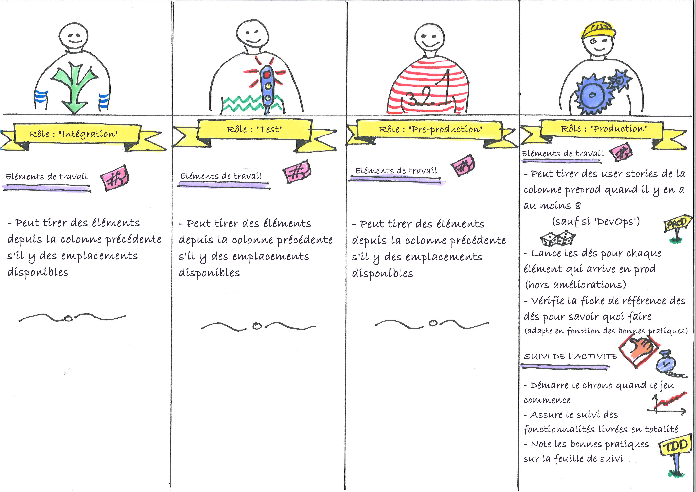

# Règles du Built-in Quality Game

[](photos/1-team.jpeg)

## Objectif du jeu

Faire passer le plus de fonctionnalités possible de l'Idée à la Production.

Expérimenter l'augmentation de la livraison de valeur à mesure que nous intégrons plus de "built-in quality" dans notre processus de développement logiciel.

## À quoi cela ressemble

Vous êtes une équipe de jeunes diplômés démarrant un nouveau projet. Vous avez beaucoup d'idées, mais tout reste à faire. Pendant le jeu, nous représenterons la construction du produit sous forme d'un [Kanban board](https://en.wikipedia.org/wiki/Kanban_board), et les éléments de travail seront de petits morceaux de papier colorés.

Au début, en tant que jeunes diplômés, vous souffrirez de votre manque de pratique du built-in quality. Avec le temps, et à mesure que vous maîtriserez les bonnes pratiques de l'industrie, vous verrez votre taux de livraison de valeur augmenter.

Chaque membre de l'équipe prendra un ou plusieurs rôles et sera responsable de tirer les éléments de travail dans sa colonne. Si quelque chose tourne mal lorsque l'élément atteint la production, il devra être retravaillé. Régulièrement, vous pouvez choisir de travailler sur la maîtrise de nouvelles pratiques au lieu de nouvelles fonctionnalités. Plus il y a de bonnes pratiques en place, plus la mise en production sera fluide.

Le jeu se joue en tours (représentant des jours). Pendant un tour, chaque membre de l'équipe peut tirer des éléments de la colonne précédente. Ce n'est que lorsque tous les joueurs ont tiré leurs éléments de travail que nous pouvons passer au tour suivant.

Le jeu se termine lorsque vous estimez en avoir assez appris. Profitez de l'occasion pour discuter de vos découvertes avec les autres participants.

Le matériel est conçu pour être aussi auto-explicatif que possible. Il devrait donc être possible de jouer sans avoir à lire toutes les instructions à l'avance.

## Agenda suggéré de la session

Voici un agenda que nous avons préparé pour un atelier conférence de 1h30.

|Phase | Détails | Durée | Temps écoulé |
|------|---------|----------|--------------|
| Présentation générale | Présenter le jeu et son objectif | 5m | 5m|
| Think it then ink it | Laisser les participants rappeler ce qu'ils savent déjà sur le built-in quality | 5m | 10m |
| Présentation du built-in quality | Résumé rapide de ce qu'est le built-in quality | 5m | 15m |
| Mise en place du jeu | Montrer les instructions et laisser les équipes configurer leur jeu | 10m | 25m |
| Jouer le niveau 0 | Le jeu commence, les participants s'habituent | 15m | 40m |
| Jouer le niveau 1 | Les participants reçoivent une première bonne pratique gratuite | 10m | 50m |
| Jouer le niveau 2 | Donner des tickets rouges (améliorations) aux participants | 20m | 1h10 |
| Learning log | Demander aux participants d'écrire ce qu'ils ont appris pendant la session, et en discuter ensemble | 10m | 1h20 |

Il repose sur le modèle d'atelier C4 présenté dans le livre [Training from the back of the room](https://www.goodreads.com/book/show/8141935-training-from-the-back-of-the-room).

Voici les [diapositives correspondantes](material/Built-In%20Quality%20Game.pdf).

### Présentation générale

Voir la section [Objectif du jeu](#).

### Think it then ink it

C'est une activité du livre [Training from the back of the room](https://www.goodreads.com/book/show/8141935-training-from-the-back-of-the-room). Voici les instructions :

`Réfléchissez à ce que vous savez déjà sur le built-in quality. Écrivez trois de ces faits sur une carte index. Soyez prêt à les énoncer lorsque cela vous sera demandé.`

### (Optionnel) One person expert jigsaw (10m)

Encore une activité du livre [Training from the back of the room](https://www.goodreads.com/book/show/8141935-training-from-the-back-of-the-room). L'objectif est de fournir différentes parties de l'information aux différentes personnes autour de la table. C'est ensuite à elles de résumer ce qu'elles ont compris et d'assembler toutes les parties ensemble.

`Vous avez chacun reçu une information différente sur le built-in quality.`

`Échangez avec vos collègues jusqu'à ce que l'un d'entre vous puisse résumer l'ensemble du contenu à toute la table.`

### Présentation du Built-in Quality

> L'inspection n'améliore pas la qualité, ni ne la garantit. L'inspection arrive trop tard. La qualité, bonne ou mauvaise, est déjà dans le produit. La qualité ne peut pas être inspectée dans un produit ou un service ; elle doit être intégrée dès le départ.
>
> —W. Edwards Deming

L'idée clé du built-in quality est la suivante : plus une erreur est commise tôt dans le processus de livraison, plus elle générera de gaspillage jusqu'à ce que la fonctionnalité satisfasse le client.
Plus tôt nous corrigeons une erreur, mieux c'est !

Par exemple :

* Si vous construisez le mauvais produit, la conception, le codage, les tests... en fait *tout* le travail sur ce produit sera gaspillé
* Si un développeur laisse un bug dans son implémentation d'une fonctionnalité, cela limitera le gaspillage aux tests, au support et à la reprise du travail
* À l'inverse, si une erreur est laissée dans la configuration de la livraison, alors elle devrait être corrigée à moindre coût

Le built-in quality est un ensemble de pratiques et de principes qui permettent d'éviter les erreurs dès le départ, au lieu d'essayer de les corriger plus tard. Pouvez-vous donner des exemples de pratiques ?

Les pratiques typiques du built-in quality incluent :

* Test Driven Development
* Behaviour Driven Development
* Continuous Integration
* Dev-Ops
* Walking Skeleton
* Lean Startup

Nous voulons illustrer cela avec un jeu. Nous verrons comment la maîtrise de ces techniques augmente le taux auquel nous pouvons livrer de la valeur.

### Mise en place du jeu

Voir la section [À quoi cela ressemble](#).

```
Commençons à jouer !

1. Formez une équipe jusqu'à 8 personnes. Essayez de mixer les profils (technique, business, test...) pour maximiser l'apprentissage.

2. Ouvrons ensemble la pochette "Niveau 0".
  - 1er, vous avez le kanban board, où vous essayerez de faire passer les éléments de travail de l'idée à la production.
  - 2e, il y a des tickets colorés représentant les éléments de travail qui vont se déplacer sur le kanban board.
  - 3e, une feuille de suivi pour suivre le nombre de fonctionnalités complètes livrées à chaque tour. En option, la personne en charge du rôle de production peut utiliser un ordinateur portable et une feuille de calcul partagée (au lieu d'une feuille de papier) pour suivre l'avancement tout au long du jeu.
  - 4e, vous avez 8 cartes de rôle. Chaque membre de l'équipe sera responsable d'une ou plusieurs colonnes du tableau Kanban. Chaque membre de l'équipe devrait choisir un ou plusieurs rôles (de préférence dans des colonnes adjacentes) et lire sa ou ses cartes de référence de rôle.
  - 5e, 2 dés et une carte de référence des dés. Lorsque vous essayerez de livrer des éléments en production, vous lancerez les dés pour voir le résultat. Si un problème survient, l'élément retournera à une colonne précédente pour être retravaillé.
  - 6e, voici les règles complètes du jeu. En cas de doute sur les règles, vous devriez y la réponse.

3. Prenez quelques minutes pour avoir une vue d'ensemble du jeu.

4. Tout deviendra plus clair en jouant. Demandez à un animateur en cas de doute.
```

Voici [un tableau de suivi Google Sheets](https://docs.google.com/spreadsheets/d/15K90zPhD02unMYQVIwJEs9rjMmrr_ksaoTUjFuXrz4g/edit?usp=sharing) que vous pouvez copier pour suivre votre progression.


### Jouer le niveau 0, 

```
Avant de vous lancer dans le jeu à pleine vitesse, il est bon de faire quelques tours de jeu blanc pour bien comprendre.

1. Commençons tous ensemble.
2. Le joueur de production doit être prêt à compter les tours et à suivre ce qui est livré.
3. À chaque tour, de droite à gauche, les joueurs peuvent tirer du travail dans leur colonne s'il y a des tickets dans la colonne précédente.
4. Faisons les premiers tours ensemble
  - 1er tour : 
     - Le joueur de l'entonnoir tire une idée dans l'entonnoir. Écrivez un ID d'idée (#1) dessus. 
     - Le joueur de production suit : tour 1 => 0 fonctionnalités
  - 2e tour :
     - le joueur du backlog produit tire le ticket #1 de l'entonnoir vers le backlog produit
     - le joueur de l'entonnoir peut tirer une nouvelle idée dans l'entonnoir, avec un nouvel ID
     - Le joueur de production suit : tour 2 => 0 fonctionnalités
  - 3e tour :
     - le joueur du backlog sprint tire *et divise* l'élément #1 du backlog produit vers le backlog sprint. Les éléments sont toujours divisés ici.
     - le joueur du backlog produit tire un autre élément de l'entonnoir vers le backlog produit
     - le joueur de l'entonnoir peut tirer une nouvelle idée dans l'entonnoir, avec un nouvel ID
     - Le joueur de production suit : tour 3 => 0 fonctionnalités
  - 4e tour : Je vous laisse continuer
5. Au 15e tour, le travail peut être poussé en production. Il est temps de pratiquer une release blanche
```

#### Rappels et notes

```
* Joueur de production : n'oubliez pas de suivre ce qui se passe !
* Ce n'est pas une bonne idée d'accumuler du travail dans les files d'attente
* Lancez les dés pour chaque élément de travail, pas une fois par livraison ou fonctionnalité
* En cas de doute : vérifiez les règles, ou demandez à un animateur
```

#### Quelques mots sur les files d'attente

> Mettons-nous des tickets dans la file d'attente si certains tickets se trouvent dans la colonne précédente et si la colonne actuelle est déjà pleine ?

Dans la file d'attente.

> Pouvons-nous choisir si nous voulons tirer des tickets de la file d'attente ou de la colonne précédente, ou est-ce prioritaire pour la colonne de la file d'attente ?

Vous pouvez le faire des deux manières, comme vous le feriez dans la réalité. Cela représente la surcharge de priorisation qui se produit dans la réalité avec les retouches ou les goulots d'étranglement.

> Pourquoi "ce n'est pas une bonne idée d'accumuler du travail dans les files d'attente" ?

Cela accumule du travail, mais ne permet pas de livrer plus rapidement. Au lieu de garder les gens occupés à créer des stocks inachevés, il serait préférable d'aider à terminer ce qui a été commencé et d'optimiser le processus pour créer un flux.

### Jouer le niveau 1

```
Maintenant que tout le monde maîtrise le jeu, jouons pour de vrai !

1. Ouvrons ensemble la pochette 'Niveau 1'
  - 1er, il y a 7 cartes de bonnes pratiques présentant les différentes améliorations possibles dans le jeu.
  - 2e, des cache-colonnes que vous utiliserez pour "sauter" des colonnes lorsque les améliorations vous le demandent.
  - 3e, une fiche de référence des pratiques, que vous lirez à voix haute lorsque vous maîtriserez une nouvelle amélioration.
2. Choisissez une bonne pratique gratuite et aléatoire. S'ils obtiennent "Craftsmanship", pas de chance, ils commencent sans rien :-(
3. Faites une pause et lisez à voix haute la section de la fiche de référence sur cette nouvelle pratique.
4. Appliquez les actions de cette bonne pratique et reprenez le jeu.
5. Comme précédemment, le joueur de production doit suivre les fonctionnalités livrées par tour
```

Voici la [fiche de référence](Practices.md).

#### Rappels et notes

```
* Lorsque vous cachez une colonne, placez les tickets existants dessus et traitez-les au tour suivant 
* Redivisez les tickets qui ont été renvoyés au backlog produit !
* Si vous atteignez la fin de la feuille de suivi, recommencez depuis la gauche 
* En cas de doute : vérifiez les règles, ou demandez à un animateur
```

### Jouer le niveau 2

```
Vous disposez maintenant de tickets rouges (améliorations) que vous pouvez utiliser pour maîtriser de nouvelles compétences.

1. Ouvrons ensemble la pochette 'Niveau 2'
  - 1er, il y a des tickets rouges (améliorations) que vous utiliserez pour suivre votre progression dans la maîtrise de nouvelles bonnes pratiques.
  - 2e, il y a la carte de référence "Comment maîtriser de nouvelles bonnes pratiques". Elle indique que vous devrez passer un ticket rouge de l'entonnoir à la production pour maîtriser une nouvelle bonne pratique.
2. Discutez jusqu'à ce que vous parveniez à un accord sur la compétence dans laquelle vous souhaitez investir.
3. Lorsque le ticket d'amélioration atteint la production, faites une pause et lisez à voix haute la section de la fiche de référence.

/!\ Tickets rouges (améliorations) :
* sont divisés comme n'importe quelle fonctionnalité
* passent en production sans lancer les dés
```

#### Rappels et notes

```
* Les tickets rouges doivent toujours être divisés
* Ne lancez pas les dés pour les tickets rouges
* Faites une pause et lisez à voix haute la section de la fiche de référence
* Si vous atteignez la fin de la feuille de suivi, recommencez depuis la gauche 
* En cas de doute : vérifiez les règles, ou demandez à un animateur
```

### Learning log

Il s'agit d'une activité du livre [Training from the back of the room](https://www.goodreads.com/book/show/8141935-training-from-the-back-of-the-room). Voici les instructions :

`En quoi ces informations changent-elles les perceptions que vous aviez précédemment sur le built-in quality ? Comment pensez-vous pouvoir utiliser ces informations ? Soyez prêt à les partager avec votre groupe.`


## Variante en temps réel

Nous avons essayé une variante en temps réel du jeu. D'un côté, c'est plus rapide et plus engageant. De l'autre côté, il n'y aura pas le même type ou la même quantité d'apprentissage.

Vous pouvez réduire cette session à 45 minutes au lieu de 75. Dans cette variante, il n'y a pas de tours. Tous les joueurs jouent simultanément et tirent continuellement des éléments dans leurs colonnes. Le temps est suivi en minutes réelles au lieu de tours.

Sachez cependant que les participants en apprendront davantage sur le flux lean que sur le built-in quality.

## Caractéristiques du jeu

### Nombre de joueurs

Le jeu se joue en équipes de maximum 8 personnes chacune. Plusieurs équipes peuvent jouer en même temps lors de la même session. Plus il y a d'équipes, mieux c'est pour discuter des apprentissages à la fin.

### Durée

1h à 1h15, y compris la préparation et l'apprentissage en fin de session.

## Matériel

Chaque équipe a besoin des éléments suivants :

### Un tableau à 8 colonnes


À imprimer en format A3

### Un tas de cartes de travail colorées

[](photos/tickets.jpg)

Le travail est représenté par de petits tickets colorés. Vous devrez découper un tas de ces tickets avant le jeu. Découpez-les pour qu'ils rentrent dans la largeur des colonnes du Kanban.

Utilisez des tickets rouges séparés pour les améliorations des bonnes pratiques.

### 7 cartes de bonnes pratiques


À imprimer en format A4

### Dés et cartes de référence des bonnes pratiques


À imprimer en format A4

### 2 dés à 6 faces


_Par Gaz at English Wikipedia [CC BY-SA 3.0](http://creativecommons.org/licenses/by-sa/3.0/), via Wikimedia Commons_

### 8 cartes de rôles




À imprimer en format A4

### Une feuille de suivi


À imprimer en format A3

### Masques de colonnes


À imprimer en format A4

### Impression grand format

Si vous le souhaitez, il peut être plus confortable de tout imprimer en deux fois plus grand.

---
[](http://creativecommons.org/licenses/by-sa/4.0/)

Built-in Quality Game by <a xmlns:cc="http://creativecommons.org/ns#" href="http://philou.github.io/built-in-quality-game/" property="cc:attributionName" rel="cc:attributionURL">Philippe Bourgau</a> is licensed under a [Creative Commons Attribution-ShareAlike 4.0 International License](http://creativecommons.org/licenses/by-sa/4.0/).